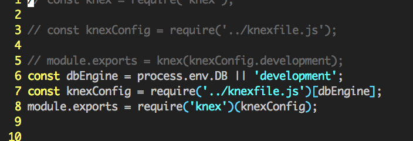
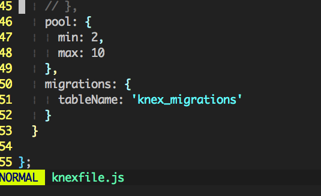
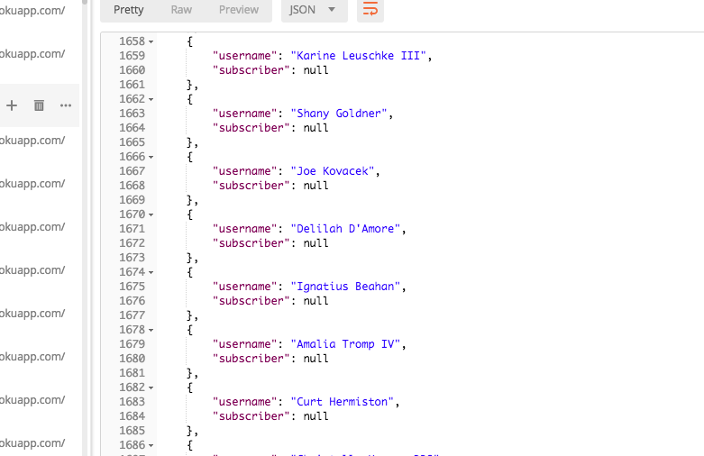
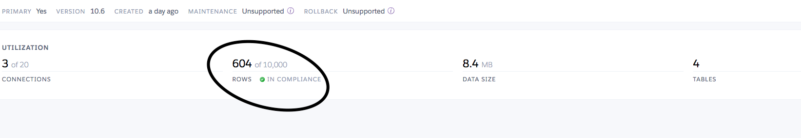

###Individual Accomplishments

Whiteboard interview. I didn't do it this week because it was optional.

Github Handle: [ceejaay](https://github.com/ceejaay?tab=repositories)

[Team's Graph](https://github.com/Lambda-School-Labs/dont-send-that-email/graphs/contributors)

###Tasks Pulled 
[Database Schema Migration](https://github.com/Lambda-School-Labs/dont-send-that-email/pull/5)

[Readme](https://github.com/Lambda-School-Labs/dont-send-that-email/pull/7)

[Added the dotenv dependency](https://github.com/Lambda-School-Labs/dont-send-that-email/pull/9)

[Added Postgres Dependency](https://github.com/Lambda-School-Labs/dont-send-that-email/pull/12)

[Finalized the Postgres settings](https://github.com/Lambda-School-Labs/dont-send-that-email/pull/16)

[Seed Data](https://github.com/Lambda-School-Labs/dont-send-that-email/pull/16)

[Fixed the database migration](https://github.com/Lambda-School-Labs/dont-send-that-email/pull/21)

Of all of these pull requests, the one we'll discuss today is this one:

[Finalized the Postgres settings](https://github.com/Lambda-School-Labs/dont-send-that-email/pull/16)

This was the most challenging pull request I did this week. I didn't know how to do it. I had to research how to deploy a Postgresql database to heroku. I went back and watched a video that Luis made. Somehow I missed it the first time around. Whoops. 

There were several parts that had to fit together in order for this pull request to work. Then it didn't even work when I finished it!
On top of doing all the work on the backend, I had to learn how to navigate heroku. Heroku is a good tool, but it has a learning curve.
I had to talk to [Jared](https://github.com/jcuff://github.com/jcuffe) about getting access to heroku. I had to talk to him several times over the week.
Next, I had to look into how environmental variables worked. Web dev has a lot of bits and pieces that have to be hidden from prying eyes.
I had to make sure those variables matched up when we pushed our code to heroku. For me, it was a bit like making a key when I didn’t know what the lock looked like. So it was hard. 

So I added the `dotenv` library and I wrote in all the variables. A nice tool that Jared showed me was the ability to deploy the branch temporarily on heroku. So I wrote in all the code and deployed the branch and it worked. So I made the PR and it was eventually merged. Yay. 
That was only part of the story. I forgot to add the postgres library to the list of dependencies. So I had to do another PR to do that. Blech. When that was finally merged. I thought I would be able to just migrate those databases and we’d be OK. Well when I typed in `heroku run knex migrate:latest` I got an error. It took me a while to figure out that the structure of our directories made it necessary to do another step when running commands on heroku. All my backend work was buried in another directory so I had to do this: `heroku run cd server && knex migrate:latest`. 

So that worked, but It was deploying the development settings in from our knex file. After walking through the code by myself, I had to ask for help. Jared was able to see where I went wrong. I didn’t specify the location of the migrations in the knex file under the production options.

Finally we had to populate the database with seed data. I did a PR for that, but I don’t think it will work. I still need to check. But Jared showed me how to write a script to add data. 

We just wrote it on the heroku command line. Eventually things worked out and we were able to show we had more than 500 entries in our DB. Overall, it was a challenging week.

 

###Development Journal Entry.
Working on a team is fun. But also hard. For 15 weeks I've worked solo. So moving to a team was a bit of a challenge. I feel like I'm pretty good at working on a team. In my prior work I worked on teams both large and small. So I'm not unfamiliar with it. Development is somewhat different. A person's skill level can affect how they participate. I feel like my skill is ok. So going into Labs I felt like was able to handle any part of the development process. In a team you have to organize your work. Early in the week we were all getting comfortable with the process and there was some awkwardness. No one wants to be the squeaky wheel. No one wants to step on toes or do something wrong. At the end of this week, I feel like we have a sense of where people’s strengths lie. In the coming weeks we’ll be able to build relationships with one another and everyone will be able to meet their goals.

