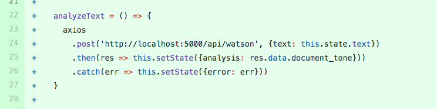

###Individual Accomplishments

I was sick this week. Lucky me I had/have [off-brand influenza that can't be treated with anti-viral drugs. :(](https://www.cdc.gov/parainfluenza/index.html) Good times. I hope I'm %100 soon. 

##### Our Team's graph.

Github Handle: [ceejaay](https://github.com/ceejaay)

###Tasks Pulled 
[I worked on getting an API to work.](https://github.com/Lambda-School-Labs/dont-send-that-email/pull/28)

[I wrote the logic for analyze button](https://github.com/Lambda-School-Labs/dont-send-that-email/pull/30)

Of all of these pull requests, the one we'll discuss today is this one:
[Logic for the analyze button](https://github.com/Lambda-School-Labs/dont-send-that-email/pull/30)

I started working on this by myself. After pair-programming on my other PR this week. I thought I'd do some solo work. I wrote it up toward the end of the day. After that, I was sure I was sick. When I came back. I saw that my team and made a bunch of changes to my work in my absence. After working alone for 15 weeks in Lambda School, you think every line of code you write is a precious gem of exquisite rarity. Then you collaborate and realize your work is trash. Well, it's not all trash. It's just not as good as you think it is.

This is screenshot of the main part of my code.

It's nothing special. A simple call to the backend to get an analysis of the text that the user will submit. I wrote this and a couple of functions to get the analyze button to work. I added some things that will be the foundation for upcoming changes. When you write code in solo, you forget how much work and how many changes go into a project. People who write for a living, novelists etc, have a saying. Writing is re-writing. In other words, you spend a lot of time fixing the things you wrote in the first place. So when writing code you could say coding is refactoring.

When I came back after my illness. I saw that one of my teammates had made a bunch of changes to my work. He added a bunch of stuff that will eventually be the bulk of the page we were working on. So overall, my work was pretty minor. It certainly wasn't the rare gem I thought it was. 

I know for sure this was trash.

Here's where I did my teammates a disservice. I didn't comment this line of code on 39 where it says `<NewEmail />`. I put this in so I could see what was happening with the app while I was working on it. I should have made a comment in here about how it could be removed. Or better yet, remove it before I committed the code to github.

I wish I hadn't gotten sick this week. There's a lot of things that my team did that I need to catch up on. 

###Development Journal Entry.

I already spoke above about how my work integrated with my teammate's work. It's starting to become clear that a medium-sized project like this will be a challenge to get all the pieces working together. One of the best tools for this challenge is git. Git makes it easier to keep track of the changes of 5 people across 5 computers. Going forward, we'll have to continue our communication. We'll have to make sure everyone is on the same page about what we are doing. Next week I'll have a better understanding of this, as this week, I was sick for three out of five days.

