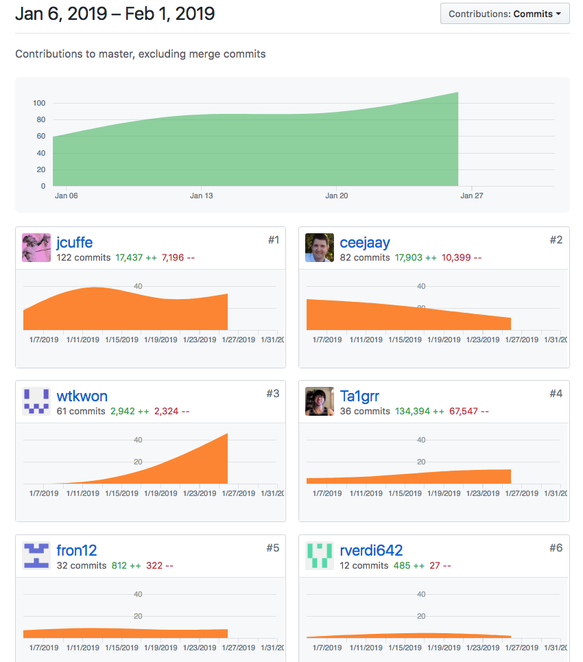
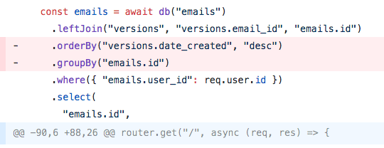
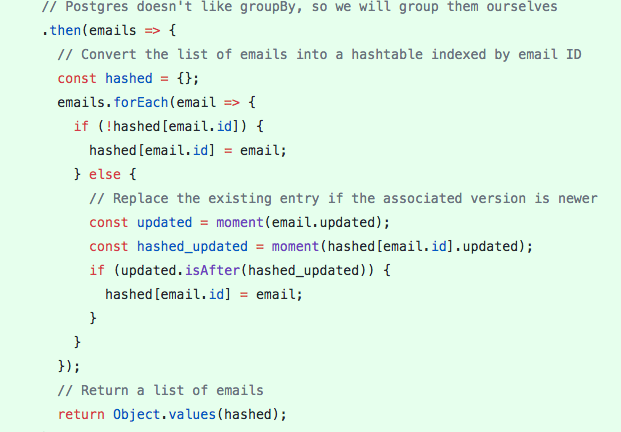

###Individual Accomplishments
[Sort Top Scores](https://www.youtube.com/watch?v=r8pwHPfYmeM&feature=youtu.be)

##### Our Team's graph.

I was pretty disappointed in my progress this week. I tried to do two things. Participate in a family event  while on the road, and keep up on my school work. Not a good combination. So the things I learned:

1. You can't do both unless you are really good at the project you are doing.
  I found when I went from doing family things to trying to catch up on the code that had changed that day It was hard to make sense of it. I'm still pretty new to this process of programming.

2. It would have helped if I had made time to attend all the meetings. My team went over the project page by page to talk about changes and planning. Missing that made it so I was unclear on what what happening and where things were going.

3. Pay for wifi on the plane. Late in my flight when I realized I couldn't do some of my work without accessing the authorization process, I finally paid for an hour of wifi. It made a big difference.

4. being out of the loop is bad. Personally, when I'm not sure what's going on, I tend to try to do things on my own. That leads to a lot of time fumbling in the dark. Constant communication with the team means a better relationship. A better relationship means it's easier to ask for help. That means less down time figuring out what's changed.

Github Handle: [ceejaay](https://github.com/ceejaay)

###Tasks Pulled 

##### Front End
[Fixed some punctuation.](https://github.com/Lambda-School-Labs/dont-send-that-email/pull/147)

##### Back End
[fixed a bug that showed duplicate docs on the page](https://github.com/Lambda-School-Labs/dont-send-that-email/pull/132)

Note: the following are the same PR. We fixed two bugs in one PR.

[Fixed the bug that was caused by the above PR](https://github.com/Lambda-School-Labs/dont-send-that-email/pull/142)

[Solved the app-breaking problem of clicking on a duplicate document](https://github.com/Lambda-School-Labs/dont-send-that-email/pull/142)

Of all of these pull requests, the one we'll discuss today is this one:
[fixed a bug that showed duplicate docs on the page](https://github.com/Lambda-School-Labs/dont-send-that-email/pull/132) and  [Fixed the bug that was caused by the above PR](https://github.com/Lambda-School-Labs/dont-send-that-email/pull/142)

We were faced with a problem. When you saved a version of the email you were working on, it would list another copy of that document in your documents list view. This turned out to be a SQL query problem. The query would look for the email message. Then it would check for all the versions. Then it would return all the versions and it's original email. Our frontend app would render every item in the array returned from the database. I thought the fix was `groupBy` which is a knex function. That worked until we put it into production. In development we use sqlite. In production we use postgresql. Postgresql does not like the `groupBy` function.

So we had to fix it. I wasn't able to fix it by myself. I had to do some pair programming. My colleague Jared Cuffe, helped me out with it. Rather, I watched while he figured it out. First we used node to do some test sql querys. We ultimately didn't figure that out. Sql is hard. So we had to come up with another solution. We finally went through the array returned from the database and only picked the latest items in the array. So we would eliminate any version that was an older duplicate. 

Here's the code:

###Development Journal Entry.
 So far, in my view, this stage of the project is hard. There are a lot of obscure bugs that require deep work to fix. This week, I worked with my teammate Jared Cuffe to fix two bugs. These were bugs that broke the look and feel of the site. As far as I know this is the kind of bug that crops up in the process of a project like this. You can't predict these kinds of problems. Or at least I can't. For me, these bugs were hard. I had to have help on them. At the beginning of this project we start coding in broad strokes. We rough in the backend. We rough in the front end. These things are fairly easy. It's the kind of thing that we spent weeks doing during the first parts of Lambda School. Now, we are learning things they didn't really teach us. For our team, we have to work together to move forward. There's a lot of collaboration on this stage. The bugs are harder. The front-end tweaks are more subtle. The technical problems are clear. On my pull request, it was clear that we had to remove duplicates. But it wasn't clear how to do that. So it required pair programming. We had to come up with a somewhat kludgy solution. But that's ok. The thing works. I think it will keep working. But there will be more obscure bugs that pop up that require refactoring and fixing. That will take the whole team.

