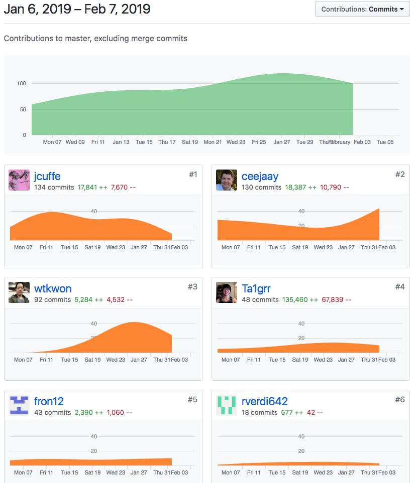

### Individual Accomplishments

##### Our Team's graph.

Github Handle: [ceejaay](https://github.com/ceejaay)

###Tasks Pulled 

##### Front End
[Added favicon and tab title text](https://github.com/Lambda-School-Labs/dont-send-that-email/pull/166)

##### Back End
[Proofread the README.md](https://github.com/Lambda-School-Labs/dont-send-that-email/pull/187)

[Fixed some links on the readme](https://github.com/Lambda-School-Labs/dont-send-that-email/pull/186)

[Wrote the directions to get an API key](https://github.com/Lambda-School-Labs/dont-send-that-email/pull/184)

[Fixed more links](https://github.com/Lambda-School-Labs/dont-send-that-email/pull/182)

[Drafted deployment instructions](https://github.com/Lambda-School-Labs/dont-send-that-email/pull/176)

[Added some image files for the above pull requests](https://github.com/Lambda-School-Labs/dont-send-that-email/pull/173)

[Early draft of Watson api key instructions](https://github.com/Lambda-School-Labs/dont-send-that-email/pull/165)

[Added images for Watson api key instructions](https://github.com/Lambda-School-Labs/dont-send-that-email/pull/161)

[Edited the sample dotenv file](https://github.com/Lambda-School-Labs/dont-send-that-email/pull/200)

Of all of these pull requests, the one we'll discuss today is this one:

[Wrote the directions to get an API key](https://github.com/Lambda-School-Labs/dont-send-that-email/pull/184)

###Development Journal Entry.

    Organization is key at this stage of app development. Especially when under a deadline. This week there were several tiny annoying bugs that needed polish. I think we did well because we were ahead of thing. Last week we exceeded our goals. So the deadline we faced wasn't a problem. I can, however imagine a world where we were under a deadline and had *twice* the things we needed to do. When you have dozens of tiny vague little bugs that need fixing, you need a clear plan on how to tackle them. If you have to do that under a deadline, you need structure. For the entire five weeks, our team grabbed stuff they felt like doing. Which was ok. Again we were usually ahead. But when you have a deadline, you can't just grab what you want. We should have assigned the bugs in the most efficient manner. Delegating them out by type and complexity. For example, we have one person tackle the three (hypothetical) css problems on one page. Then have two people take on the more technical problem of our message editor. For us, things went well. But in other circumstances, our work would require more orgnization.

